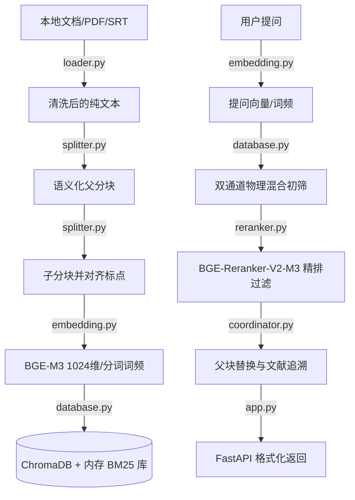

# 🚀 Advanced RAG: 工业级混合检索与语义分层切片检索引擎

**拒绝粗暴分块，让你的大模型拥有最纯净、最精准的上下文长效记忆。**

---

## 🎯 价值陈述 (Value Proposition)

传统 RAG 经常因为“固定字符长度暴力截断”导致段落语境支离破碎，又因为“单路检索”面临专有名词匹配率低的困境。
本项目是一个高内聚、低耦合的**二阶段工业级 RAG 引擎**：
*   **🧠 语义波谷切片**：自动识别文章自然句群的相似度波谷，在段落分界处切割，保留核心语义上下文。
*   **🛡️ 父子双层关联**：向量库仅检索极短的子块以提高匹配率，返回给大模型时自动替换为丰满的父块段落。
*   **🔗 物理级双路混合检索**：Dense（BGE-M3 语义）+ Sparse（内存 BM25 词频）物理融合，专有名词与长句概念召回率均达到工业级标准。
*   **⚡ 100% 离线与 Windows 容错优化**：解决本地模型软链接引起的卡死问题，实现秒级离线冷启动。

---

## 🏗️ 技术架构设计 (Architecture)

系统内部采用模块化解耦设计，各组件分工明确，数据流动链路如下：



---

## ⚡ 特性矩阵 (Feature Matrix)

| 特性名称 | 解决什么痛点 | 我们的实现方案 |
| :--- | :--- | :--- |
| **滑窗语义切片** | 传统 RAG 在固定长度处一刀切断，导致一句话被劈成两半，大模型无法理解。 | 用滑动窗口判定句子相似度波谷，仅在相似度低于动态阈值的自然段落处进行物理切割。 |
| **标点对齐切片** | 子分块分割时暴力切断词语。 | 从预设长度向左倒退寻找最近的标点符号（如 `。` `；` `\n`）处安全断开。 |
| **双通道物理融合** | 纯语义向量检索对“型号”、“人名”等强硬实体词的匹配准确度较低。 | 第一路 Dense 召回语义；第二路基于内存构建 BM25 稀疏索引进行词频召回，两路在写入时同步，在检索时物理去重。 |
| **父块替换与追溯** | 喂给大模型的子块内容过短、废话多，且无法证明回答的真实出处。 | 检索匹配高分子块，返回时自动替换为其元数据中的父块大段落，并追加 `(来源: 文件名)` 溯源标记。 |

---

## 🔧 闪电部署 (Quick Start)

### 1. 依赖环境安装
确保您已安装好 Conda，在终端运行以下命令克隆并配置：
```powershell
# 1. 激活已安装好 PyTorch 的环境
conda activate deepseek-ocr

# 2. 安装必要依赖（ChromaDB, FastAPI, uvicorn 等）
pip install chromadb fastapi uvicorn pydantic sentence-transformers rank_bm25 jieba fitz python-docx
```

### 2. 启动 API 服务
```powershell
# 在项目根目录下，启动微服务进程
python -m uvicorn src.app:app --reload
```

---

## 📖 核心操作手册 (User Guide)

### 1. 监工交互界面视角 (Swagger)
启动后，在浏览器访问：[http://127.0.0.1:8000/docs](http://127.0.0.1:8000/docs)
您可以通过 Swagger UI 进行可视化的动态操作：

*   **录入本地文件**：
    1. 展开 `/add_file` POST 模块，点击 **Try it out**。
    2. 在 `file_path` 中输入本地文件绝对路径（使用正斜杠 `/`，**禁止使用单反斜杠**，只套一层英文双引号）：
       ```json
       {
         "file_path": "E:/data/my_file.txt"
       }
       ```
    3. 点击 **Execute**，看到返回 `200` 和 `"status": "success"` 即表示该文件已成功分块、索引入库。
*   **混合检索提问**：
    1. 展开 `/retrieve` POST 模块，点击 **Try it out**。
    2. 输入提问及期望召回数量：
       ```json
       {
         "query": "Conda环境怎么激活",
         "top_k": 3
       }
       ```
    3. 点击 **Execute**，您将在下方看到由重排算法优化后、且包含 `(来源: ...)` 溯源信息的格式化上下文。

### 2. 开发者 API 调用视角 (Python)
如果您想将本引擎接入您的其他业务系统（如 Dify 自定义工具），可以使用如下极简代码：

```python
import requests

# 1. 录入文件
add_res = requests.post(
    "http://127.0.0.1:8000/add_file",
    json={"file_path": "E:/data/rules.txt"}
)
print("导入结果:", add_res.json())

# 2. 检索问答上下文
query_res = requests.post(
    "http://127.0.0.1:8000/retrieve",
    json={"query": "请问如何请假？", "top_k": 3}
)
context = query_res.json()["context"]
print("召回上下文:\n", context)
```

---

## ⚙️ 配置与进阶调优指南 (Config & Tuning)

### 1. 白话参数解析
*   `child_size` (默认 150): 子块切割字符长度。如果您处理专业术语密集的文档，建议调小（如 100），以提高检索的精准性；如果是一般叙述性文档，可调大（如 200）。
*   `threshold` (默认 None): 语义波谷的判定阈值。默认为 `None` 时，系统会自适应计算 `Mean - 0.8 * StdDev` 曲线判定断句点。如果您希望切片更细，可以手动设大（如 0.6）；如果希望段落更大，可设小（如 0.4）。
*   `db_dir` (默认 "./vector_db"): 本地 ChromaDB 数据库存储路径。

### 2. 常见问题排查与避坑指南 (Troubleshooting)

| 遭遇现象 | 潜在原因 | 自闭环排查与方案 |
| :--- | :--- | :--- |
| **API 解析报错 422 `Expecting ',' delimiter`** | 输入的 JSON 路径中含有未转义的反斜杠 `\`，或者多套了双引号。 | 检查输入框，确保路径中所有的反斜杠替换为正斜杠 `/`（如 `E:/data/`），且值的外侧只套了一层英文双引号。 |
| **导入成功但查询返回 `context: ""`** | 1. 数据库未初始化成功；<br>2. 导入的 PDF 为纯图片扫描件，无文字层。 | 新增的代码中已增加了空文本强拦截机制。如果是扫描版 PDF，接口会抛出 500 明确报错。请更换为有真实文本层的 PDF、DOCX 或 TXT 再次尝试。 |
| **测试和启动时进程无限挂起 (卡死)** | 本地模型符号链接（Symlink）解析失败，强行联网下载被墙。 | 检查并确保运行了 `realize_hf_symlinks.py` 脚本，将 HuggingFace 缓存中的链接彻底替换为物理实体文件，强离线模式即可秒过。 |
