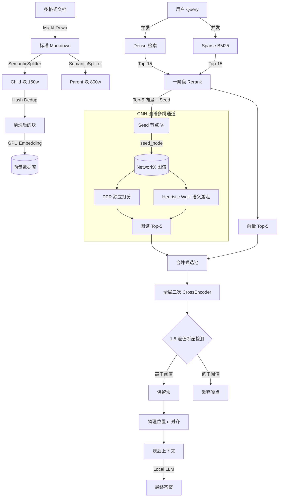

# 🚀 Advanced RAG: 语义切片 · 自适应断崖 · 图拓扑增强引擎

<p align="center">
  
  
  
  
</p>

<p align="center">
  💡 <a href="#-实现路径-从朴素检索到图谱推理">实现路径</a>&nbsp&nbsp | &nbsp&nbsp ⚡ <a href="#-核心特征矩阵">核心特征</a>&nbsp&nbsp | &nbsp&nbsp 🏗️ <a href="#-系统架构">架构设计</a>&nbsp&nbsp | &nbsp&nbsp 📊 <a href="#-评测结果">评测结果</a>&nbsp&nbsp | &nbsp&nbsp 🚀 <a href="#-快速开始">快速开始</a>
</p>

**让检索增强不再被低维噪音稀释，边缘设备也能享有极致的上下文对齐。**

---

## 💡 实现路径：从朴素检索到图谱推理

本项目是一个逐步演进的 RAG 引擎，每一次迭代都针对特定痛点做了针对性突破。完整的实现路径如下：

```
朴素向量检索 (Naive RAG)
  └─→ 语义父子切片 + 哈希去重 (Advanced Vector RAG)
       └─→ CrossEncoder 重排 + 自适应断崖截断 (Pipeline RAG)
            └─→ 内存图拓扑 + 双路游走 + 全局二次重排 (GNN-Enhanced RAG)  ← 当前
```

### Stage 1 — 语义切片与去重瓶颈
传统分块要么破坏上下文连贯性（块过小），要么语义模糊（块过大）。我们用 **150词 Child 块** 做精细检索、**800词 Parent 块** 做上下文替换，配合 **滑动窗口哈希去重** 将 Embedding 吞吐量提高了 4.79 倍。

### Stage 2 — 噪声管控与断崖阻断
固定 Top-K 检索容易夹带低相关噪点。我们引入 **CrossEncoder 二次重排** + **自适应语义断崖截断**：动态检测相邻块的分值落差，一旦超过 1.5 即判定为"语义断崖"并强制阻断，过滤了高达 50% 的无效 Token。

### Stage 3 — GNN 图拓扑增强（当前）
单一向量检索无法处理跨章节、远物理跨度的**隐式多跳推理**。我们在内存中用 NetworkX 维护一个高维知识图谱：
- 三轨连边底座（物理相邻边 / 实体共现边 / 语义关联边）
- 两路解耦图游走算法（PPR 独立打分 / Heuristic Walk 语义引导）
- 双通道断崖 + 空间紧邻重排
- **全局二次重排** 融合向量结果与图谱结果，进一步阻断语义漂移

> 完整的四轨消融评测结果详见：[docs/evaluation/gnn_ablation.md](docs/evaluation/gnn_ablation.md)

---

## ⚡ 核心特征矩阵

| 核心特性 | 底层痛点 | 技术方案 | 转化价值 |
| :--- | :--- | :--- | :--- |
| **📂 多格式文档转译** | Word/Excel/PDF 格式混乱、切片乱码 | 异步调用 MarkItDown 将多种文档统一转为标准 Markdown | 彻底解决多格式输入源格式不纯问题 |
| **🧠 语义父子切片** | 分块破坏上下文连贯性 | Child 150w 检索 + Parent 800w 上下文替换 | 兼顾高召回率与长语境连贯性 |
| **🧹 哈希去重** | 滑动窗口重合片段浪费算力 | CPU 端指纹比对 + GPU Batch 矩阵推理 | Embedding 阶段提速 4.79 倍 |
| **🛡️ 自适应断崖阻断** | 固定 Top-K 夹带噪点引发幻觉 | CrossEncoder 差值断崖检测（阈值 1.5） | 过滤 50% 无效 Token，降低幻觉率 |
| **⚡ 双通道并发** | Dense/Sparse 串行调度响应慢 | ThreadPoolExecutor 并发 Chroma + BM25 | 首包时延压缩至毫秒级 |
| **🔗 内存图谱拓扑连边** | 向量检索无法跨章节多跳 | NetworkX 三轨建图（物理/语义/实体） | 将建图复杂度降至 O(N) |
| **🧭 双路图游走** | 单一游走模式语义漂移严重 | PPR 拓扑打分 + Heuristic Walk 语义引导 | 同时保障"事实多跳"与"逻辑推理" |
| **🔄 全局二次重排** | 图谱邻居掺杂拓扑噪点 | 向量 Top-5 与图谱 Top-5 合并后统一 CrossEncoder 精排 | 彻底阻断语义漂移 |
| **🔒 离线部署 & OOM 防护** | 联网依赖 + 边缘显存不足 | 模型缓存固化 + 自适应 CPU/GPU 调度 | 12GB 显卡零 OOM 运行 |

---

## 🏗️ 系统架构

### 数据流总览



上面包含了**文档入库**、**向量 + BM25 双路检索**、**GNN 图谱多跳**、**全局二次重排与断崖裁剪**、**物理对齐** 的全流程。

### GNN 图谱增强核心设计

#### 1. 三轨自适应拓扑连边

在 `database.py` 中用 NetworkX 对父块数据建图，三轨并行建边：

| 连边类型 | 条件 | 作用 |
|:---|:---|:---|
| **物理相邻边** | 同文件内按 `char_start` 顺序前后连接 | 保障段落级上下文连续性 |
| **实体共现边** | 跨文档共享专有名词（人名/地名/团体名），取单块局部 Top-5 核心词 | 跨文件长程逻辑跳跃 |
| **语义关联边** | 同文档内余弦相似度 ≥ 0.85 | 局域语义拓扑 |

**Hub 词保护**：全局出现频率 > `max(5, N_nodes × 20%)` 的通用高频词自动排除，防止图谱稠密爆炸。

> 专有名词严格限定词性为 `nr`（人名）/ `ns`（地名）/ `nt`（团体）/ `nz`（专名），过滤掉 90% 以上的普通名词噪点。

#### 2. 两路解耦图游走

| 游走算法 | 打分方式 | 适用场景 |
|:---|:---|:---|
| **Personalized PageRank (PPR)** | `Seed 分值 × 全图拓扑转移概率 PPR(v)` | 全局拓扑扩散，挖掘间接关联 |
| **Heuristic Walk (语义随机游走)** | 1 跳取 Top-3 语义近邻 → 2 跳取 Top-2 → `Seed × Sim(v, Query)` | 显式 Query 引导，避免语义漂移 |

#### 3. 双通道断崖截断

- **向量断崖**：一阶段精排相邻落差 > 1.5 时截断
- **门控熔断**：若 Seed 分值 < 0.5，不启动图游走
- **图谱断崖**：图谱邻居中第二名得分低于第一名的 40% 时丢弃

#### 4. 空间紧邻重排 (Spatial Proximity)

为防止 Lost-in-the-Middle 效应，最终上下文顺序强制规划为：

```
[V₁ (Seed), G₁, G₂, V₂, V₃, ...]  → 物理位置 α 对齐重排
```

图谱邻居紧插在 Seed 之后，保障小模型注意力集中。

---

## 📊 评测结果

### 1. 高质量切片 + 自适应断崖评测（通用技术问答）

在 12GB 显卡环境下对技术论文中英文 Q&A 的双轨对比：

| 评估维度 | Naive RAG (10分) | Advanced RAG (10分) | 提升 |
|:---|:---:|:---:|:---:|
| **忠实度 (Faithfulness)** | 9.7 | **9.8** | +1.03% |
| **答案相关性 (Answer Relevance)** | 9.5 | **9.7** | +2.11% |
| **内容精确度 (Accuracy)** | 9.2 | 9.2 | 持平 |

高级 RAG 在忠实度与相关性上均有提升，归功于语义断崖机制和父子替换。

### 2. GNN 图拓扑消融评测（三国演义隐式多跳推理）

> 这是本项目当前最核心的评测。详见专用报告：[docs/evaluation/gnn_ablation.md](docs/evaluation/gnn_ablation.md)

**评测设定：** 10 道高联通隐式多跳推理题 × 三国演义白话文、四轨消融（4 RAG 变体 × 3 评分维度）、`qwen3.6-35b-a3b-opus-nothink` 裁判打分（0-1 分，×10 换算）

| RAG 检索变体 | 忠实度 (Faithfulness) | 答案相关性 (Answer Relevance) | 内容精确度 (Accuracy) |
|:---|:---:|:---:|:---:|
| **Naive RAG**（仅向量检索） | 5.8 | 5.5 | 2.9 |
| **Traditional RAG**（向量 + Rerank） | 6.5 | 4.9 | 2.7 |
| **PPR Graph RAG**（PPR 游走 + 全局二次重排） | **8.3** | **7.9** | **6.4** |
| **Heuristic Walk Graph RAG**（语义游走 + 全局二次重排） | **8.2** | **7.8** | **6.3** |

**核心发现：**
- 两路 GNN 变体在三维指标上**全面包围**传统向量检索
- **PPR Graph RAG** 凭借全局拓扑扩散，在忠实度和 Accuracy 上均拔得头筹（8.3 / 6.4）
- **Heuristic Walk Graph RAG** 以显式 Query 语义引导随行裁剪，紧随其后
- 传统 RAG 因缺乏多跳通路，在 Accuracy 上反而低于 Naive（2.7 vs 2.9），说明纯向量 + Rerank 不适用于隐式多跳场景

> 雷达图输出：[tests/outputs/evaluation_radar.png](tests/outputs/evaluation_radar.png)

---

## 🚀 快速开始

### 环境部署

```bash
# 创建主环境
conda create -n advanced-rag python=3.12 -y
conda activate advanced-rag
pip install -r requirements.txt

# 独立的文档转换环境（防版本冲突）
conda create -n markitdown-env python=3.12 -y
conda activate markitdown-env
pip install markitdown[all]
```

### 启动服务

```bash
# 自动加载 CPU/GPU 模型，启动 RAG 后端 API
python src/app.py

# Swagger 调试：http://127.0.0.1:8000/docs
```

### 运行评测管线

```bash
# 交互式控制菜单
python scripts/evaluation/run_pipeline.py

# 一键跑完全流程（出题 → 多轨检索 → 答题 → 裁判打分 → 雷达图）
python scripts/evaluation/run_pipeline.py --all --sanguo
```

### 运行 GNN 单元测试

```bash
pytest tests/test_database_graph.py tests/test_graph_search.py -v
```

---

## 📂 核心模块索引

| 模块 | 文件 | 功能 |
|:---|:---|:---|
| **文档提取** | [loader.py](src/loader.py) | MarkItDown 多格式转 Markdown |
| **切片去重** | [splitter.py](src/splitter.py) | 语义父子切片 + 哈希去重 |
| **向量表征** | [embedding.py](src/embedding.py) | GPU/CPU Embedding |
| **数据库适配** | [database.py](src/database.py) | Chroma 向量库 + NetworkX 三轨建图 |
| **图游走检索** | [graph_search.py](src/graph_search.py) | PPR + Heuristic Walk + 全局二次重排 |
| **精排重写** | [reranker.py](src/reranker.py) | CrossEncoder 精排 + 断崖检测 |
| **工作流控制** | [coordinator.py](src/coordinator.py) | 全链路编排 |
| **微服务 API** | [app.py](src/app.py) | FastAPI 服务入口 |
| **评测数据** | [answer_sanguo_results.json](tests/temp_data/answer_sanguo_results.json) | 三国演义评测答题结果 |
| **评测评分** | [evaluation_sanguo_scores.json](tests/temp_data/evaluation_sanguo_scores.json) | 四轨消融评分 |
| **评测雷达图** | [evaluation_radar.png](tests/outputs/evaluation_radar.png) | 可视化对比 |
| **评测报告** | [docs/evaluation/gnn_ablation.md](docs/evaluation/gnn_ablation.md) | 完整评测方法与分析 |

---

## ⚖️ License

MIT License，详情见 [LICENSE](LICENSE)。
