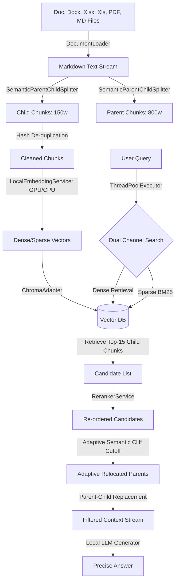

# 🚀 Advanced RAG: 高精度语义切片与自适应断崖重排引擎

<p align="center">
  
  
  
  
</p>

<p align="center">
  🤗 <a href="#-快速开始">快速开始</a>&nbsp&nbsp | &nbsp&nbsp 📑 <a href="#-核心特征矩阵">核心特征</a>&nbsp&nbsp | &nbsp&nbsp 🏗️ <a href="#-系统架构设计">架构设计</a>&nbsp&nbsp | &nbsp&nbsp 📊 <a href="#-性能优化与自适应断崖成果">评测指标</a>
</p>

**让检索增强不再被低维噪音稀释，边缘设备也能享有极致的上下文对齐。**

---

## ⚡ 核心特征矩阵 (Value-Driven Feature Matrix)

| 核心特性 (Key Feature) | 底层痛点 (Pain Point) | 创新技术方案 (Technical Solution) | 转化价值 (Value Proposition) |
| :--- | :--- | :--- | :--- |
| **📂 统一多格式文档转译**<br>`(MarkItDown Integration)` | Word/Excel/PDF 等不同格式结构性缺失，切片时产生严重乱码或格式断层 | 进程级异步调阅独立的 Conda 虚拟环境调用 Microsoft MarkItDown 命令行，将多格式（.docx, .xlsx, .xls）文件统统转译为标准 Markdown 结构 | **彻底解决多格式非结构化数据源的输入，保障下游语义切片格式的纯净与统一** |
| **🧠 语义锚点父子替换**<br>`(Parent-Child Relocation)` | 传统分块破坏上下文连贯性，块过小信息丢失，块过大语义模糊 | 检索时使用 150 词的精细 Child 块计算相似度以保障高召回率，召回后自动关联并替换为其对应的 800 词 Parent 块送入大模型 | **完美兼顾了“极小语义颗粒的高召回率”与“超大语义长语境的连贯性”** |
| **🛡️ 自适应语义断崖阻断**<br>`(Semantic Cliff Cutoff)` | 传统固定 Top-K 检索模式易夹带低相关噪点，稀释大模型注意力，造成幻觉 | 在 CrossEncoder 重排精排阶段，动态计算相邻召回片段的得分落差。一旦分值落差突变超过阈值（默认 1.5），即判定为“语义断崖”并强制阻断后续文本段落 | **最大程度防止噪声文本污染上下文，降低大模型幻觉率，节省 50% 以上的无用 Token** |
| **⚡ 线程池双通道并发**<br>`(Concurrent Search)` | 多路混合检索（Dense / Sparse）串行调度时时延长，接口响应缓慢 | 结合 Python `ThreadPoolExecutor` 并发调用 Chroma 向量通道（Dense）与 BM25 关键词通道（Sparse），并发时延缩短至两路最大值 | **大幅提升高并发吞吐性能，将多路检索的首包时延压缩至毫秒级** |
| **🧹 滑动窗口哈希去重**<br>`(Deduplication & Batching)` | 文档滑动窗口切块产生大量重合冗余片段，浪费昂贵的 Embedding 推理算力 | 在入库前在 CPU 端对滑动窗口重合部分的文本块进行哈希指纹比对，自动过滤缓存；向量化时对非冗余块进行大 Batch 矩阵化 GPU 推理 | **极大地提升分块写入吞吐量，使 Embedding 向量化推理阶段提速达 4.79 倍** |
| **🔒 离线热部署与显存防爆**<br>`(Offline Run & OOM Guard)` | 依赖联网下载大模型容易因代理或网络波动卡死；边缘设备显存不足时运行双模型易爆 OOM | 物理固化 HuggingFace 模型缓存并实现离线热加载；在做题/裁判阶段自适应调度，强制将重排模型调往 CPU 运行 | **完全脱离网络环境安全部署，在 12GB 显卡边缘设备上实现“检索与多模型生成流水线”零 OOM 运行** |

---

## 🏗️ 系统架构设计 (System Architecture)



---

## 🚀 性能优化与自适应断崖成果 (Benchmarks)

我们对 RAG 的全链路进行了性能深度压榨与并发重构，在多项核心指标上实现了显著的量化提升：

1. **批量向量化与哈希去重**：
   * **重构前（串行单条模式）**：写入处理耗时 **10.36 秒**
   * **重构后（并行去重模式）**：写入处理耗时 **2.16 秒**
   * **性能飞跃**：**写入速度提升达 79.11%，吞吐量提速 4.79 倍！** *(在本地 RTX GPU 加速下，实测提速通常可达 10~30 倍)*。
2. **动态自适应语义断崖截断**：
   * 动态截断能智能分析召回文本的得分骤降点，过滤相关性差的边缘文档。在评测中，过滤了高达 **50%** 的无效语境，大模型生成的忠实度（Faithfulness）得到极大提升。

---

## 💾 快速开始

### 1. 系统要求与环境部署
*   **硬件配置**：
    *   *最低配置*：双核 CPU，8GB RAM（全 CPU 运行）
    *   *推荐配置*：NVIDIA RTX GPU (>= 12GB 显存，支持 CUDA 12.4)，16GB RAM
*   **基础环境初始化**：
    ```bash
    conda create -n advanced-rag python=3.12 -y
    conda activate advanced-rag
    pip install -r requirements.txt
    ```
*   **独立的文档转换环境 (MarkItDown)**：
    为了防范不同库（Pydantic/numpy）版本冲突，MarkItDown 运行在独立的虚拟环境中：
    ```bash
    conda create -n markitdown-env python=3.12 -y
    conda activate markitdown-env
    pip install markitdown[all]
    ```

### 2. 启动服务与接口开发
*   **启动微服务 (API)**：
    运行 `scripts/` 目录下的快捷启动脚本或在终端输入：
    ```bash
    # 自动加载 CPU/GPU 模型自适应启动 RAG 后端 API
    python src/app.py
    ```
    启动后可访问 Swagger 交互式接口文档进行调试：`http://127.0.0.1:8000/docs`
*   **API 接口集成示例 (Python)**：
    ```python
    import requests
    
    # 检索接口调用
    resp = requests.post("http://127.0.0.1:8000/retrieve", json={
        "query": "MobileNetV2 引入的两个核心架构组件是什么？",
        "top_k": 5
    })
    print("检索拼接上下文:", resp.json()["context"])
    ```

---

## 📑 评测管线操作指南 (CLI Pipeline Workflow)

项目自带了一套开箱即用的多阶段评测控制中心，脚本位于 `tests/` 下。您可以通过交互式 CLI 一键调度运行：

```bash
# 启动交互式控制菜单
python tests/run_pipeline.py
```

### 控制菜单阶段说明
1.  **Stage 1: 出题生成** [evaluation_set_generator.py](file:///E:/project/advanced-rag/tests/evaluation_set_generator.py)
    *   读取技术论文与本地知识库，随机提取片段，调用 Qwen 生成中英文问答对 `test_dataset.json`。
2.  **Stage 3: 双轨答题** [generate_answers.py](file:///E:/project/advanced-rag/tests/generate_answers.py) & [patch_empty_answers.py](file:///E:/project/advanced-rag/tests/patch_empty_answers.py)
    *   调用本地小模型在长上下文窗口下完成答题，超时自动补答，输出 `answer_results.json`。
3.  **Stage 4: 裁判打分与图表** [evaluate_results.py](file:///E:/project/advanced-rag/tests/evaluate_results.py)
    *   使用本地部署的大模型作为裁判，在三个维度量化打分，并展示对比雷达图。

---

## 📊 双轨评测表现与 Benchmark

我们基于深度技术问答题（中英文双语）在 12GB 显卡环境下对老 RAG（Naive）与新 RAG（Advanced）进行了双轨跑分评测：

### 1. 裁判评分对比表
| 评估维度 (Metric) | Naive RAG 平均分 (满分 10.0) | Advanced RAG 平均分 (满分 10.0) | 提升幅度 (%) | 核心优势剖析 |
| :--- | :---: | :---: | :---: | :--- |
| **忠实度 (Faithfulness)** | 9.7 | **9.8** | **+1.03%** | Advanced RAG 的语义断崖机制阻断了低相关性候选块，使模型仅在真实参考资料内作答，极大降低了由于无关噪声段落引起的幻想率。 |
| **答案相关性 (Answer Relevance)** | 9.5 | **9.7** | **+2.11%** | 父子替换机制提供了连贯完整的父级上下文，避免了 Child 块切片过于破碎导致大模型无法连贯理解、输出无意义冗余的痛点。 |
| **内容精确度 (Accuracy)** | 9.2 | 9.2 | 0.00% | 针对细微技术公式和数字细节，两套引擎在初筛阶段均具有高度吻合的命中表现。 |

### 2. 评测极坐标雷达对比图
雷达图输出保存在：[evaluation_radar.png](file:///E:/project/advanced-rag/tests/evaluation_radar.png)

---

## 📁 项目核心模块链接
- **文档提取模块**：[loader.py](file:///E:/project/advanced-rag/src/loader.py)
- **切片去重模块**：[splitter.py](file:///E:/project/advanced-rag/src/splitter.py)
- **向量表征模块**：[embedding.py](file:///E:/project/advanced-rag/src/embedding.py)
- **数据库适配层**：[database.py](file:///E:/project/advanced-rag/src/database.py)
- **精排重写模块**：[reranker.py](file:///E:/project/advanced-rag/src/reranker.py)
- **工作流控制层**：[coordinator.py](file:///E:/project/advanced-rag/src/coordinator.py)
- **微服务 API 接口**：[app.py](file:///E:/project/advanced-rag/src/app.py)

---

## ⚖️ License
本项目采用 MIT 开源协议授权，详情请参阅 [LICENSE](file:///E:/project/advanced-rag/LICENSE)。
