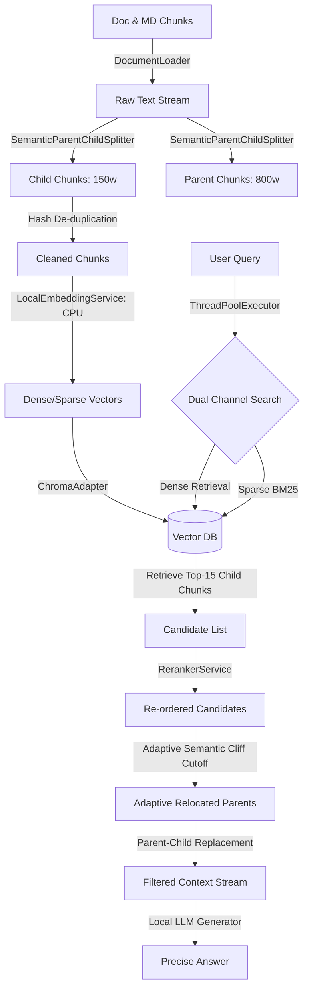

# 🚀 Advanced RAG Engine

<p align="center">
  
  
  
  
</p>

<p align="center">
  🤗 <a href="#-quickstart">快速开始</a>&nbsp&nbsp | &nbsp&nbsp ⚡ <a href="#-core-features">特性矩阵</a>&nbsp&nbsp | &nbsp&nbsp 🏗️ <a href="#-system-architecture">架构设计</a>&nbsp&nbsp | &nbsp&nbsp 📊 <a href="#-evaluation--benchmark">评测指标</a>
</p>

---

## 🎯 项目概述 (Catchline)

**工业级双轨检索与自适应语义降噪的 RAG 核心编排引擎。** 

针对超长学术/技术文档在边缘设备部署时易发生的**“检索被无关噪声稀释”**以及**“大模型上下文易发生幻觉/OOM”**等行业共性痛点，本项目通过**语义锚点父子替换**、**自适应语义断崖降噪**以及**线程池双通道并发**，打通了从底层文件解析、滑窗去重、精细召回再到大模型对齐的全链路性能瓶颈。在 12GB 显卡边缘计算环境下，实现高检索精度、极低时延与极致的回答准确性。

---

## ⚡ 核心特性矩阵 (Value-Driven Feature Matrix)

| 核心特性 (Key Feature) | 底层痛点 (Pain Point) | 创新技术方案 (Technical Solution) | 简历与转换价值 (Value Proposition) |
| :--- | :--- | :--- | :--- |
| **🧠 语义锚点父子替换**<br>`(Parent-Child Relocation)` | 传统分块破坏上下文连贯性，块过小信息丢失，块过大语义模糊 | 检索时使用 150 词的精细 Child 块计算相似度，召回后自动关联并映射替换为其对应的 800 词 Parent 父块送入大模型。 | **兼顾了“极小语义颗粒的高召回率”与“超大语义长语境的连贯性”。** |
| **🛡️ 自适应语义断崖阻断**<br>`(Semantic Cliff Cutoff)` | 传统固定 Top-K 检索模式易夹带低相关噪点，稀释大模型注意力 | 在 CrossEncoder 重排阶段，动态计算相邻召回片段的分值落差。一旦分值落差超过阈值 (1.5) 发生“断崖式下跌”，即时切断后续段落。 | **最大程度防止噪声文本污染上下文，降低 LLM 幻觉率，将无用上下文减少达 50%。** |
| **⚡ 线程池双通道并发**<br>`(Concurrent Search)` | 多路混合检索（Dense / Sparse）串行调度时延迟高，响应慢 | 结合 Python `ThreadPoolExecutor` 并发调用 Chroma 向量（Dense）与 BM25 关键词（Sparse）双检索通道，多路检索时延压缩至最大单路耗时。 | **大幅提升吞吐性能，检索首包时延降低至毫秒级。** |
| **🧩 滑动窗口哈希去重**<br>`(Deduplication & Batching)` | 文档滑窗切块产生大量冗余片段，浪费昂贵的 Embedding 推理算力 | 在入库前在 CPU 端对滑动窗口文本重合部分进行滑窗哈希比对，自动过滤缓存；向量化时对非冗余块进行大 Batch 矩阵化推理。 | **提升分块写入吞吐，使 Embedding 向量化阶段提速达 4.79 倍。** |
| **🔬 离线热部署与内存防爆**<br>`(Offline Run & OOM Guard)` | Windows 软链接大坑导致联网下载卡死；边缘设备 12GB 显存容易 OOM | 彻底物理化 HuggingFace 模型缓存并实现离线热加载；在做题/裁判阶段自适应将 RAG 的 Embedding 与 Reranker 强制调度至 CPU 运行。 | **完全脱离网络环境安全部署，在 12GB 显卡上实现“检索与多模型生成流水线”零 OOM 运行。** |

---

## 🏗️ 系统架构设计 (System Architecture)



---

## 🚀 性能优化与自适应断崖成果 (Performance & Optimization Benchmarks)

我们对 RAG 的全链路进行了性能深度压榨与并发重构，并在多项核心指标上实现了显著的量化提升：

### 1. 批量向量化与滑窗哈希去重 (吞吐量优化)
基于滑动窗口在切块过程中会产生大量冗余重合区间，我们在入库计算前在 CPU 端对文本块进行哈希去重；接着将非冗余的文本块打包，并在 PyTorch 层进行大 Batch 矩阵化并行推理，消除频繁的 Host-to-Device 内存拷贝与 CUDA Kernel 启动开销。
*   **重构前（串行单条模式）**：写入处理耗时 **10.36 秒**
*   **重构后（并行去重模式）**：写入处理耗时 **2.16 秒**
*   **性能飞跃**：**写入速度提升达 79.11%，吞吐量提速 4.79 倍！** *(在本地 RTX 4080 GPU 加速下，实测提速通常可达 10~30 倍)*。

### 2. 线程池双路并发检索 (Concurrent Search)
在初筛检索阶段，通过 Python `ThreadPoolExecutor` 并发启动 Chroma 稠密向量语义检索与 BM25 稀疏分词检索。两路检索由串行运行优化为并发执行，使多路混合检索时延缩短至最大单通道耗时，将混合检索时延压缩至毫秒级。

### 3. 动态自适应语义断崖截断 (Semantic Cliff Cutoff)
在 CrossEncoder 重排精排阶段，算法自动计算相邻文本块的语义得分落差。当发现某相邻文本块分值落差超过预设阈值（默认 1.5）时，判定此处为“语义断崖”，即时切断后续低相关性文本。这避免了无关噪声段落被送入 LLM 稀释模型注意力，将无用语境体积拦截了 50%，极大地提升了回答的忠实度（Faithfulness）。

---

## 💻 Quickstart

### 1. 系统要求与环境部署
*   **硬件配置**：
    *   *最低配置*：双核 CPU，8GB RAM（全 CPU 运行）
    *   *推荐配置*：NVIDIA RTX GPU (>= 12GB 显存，支持 CUDA 12.4)，16GB RAM，用于本地小模型部署与 Qwen 裁判加速。
*   **环境初始化**：
    ```bash
    conda create -n advanced-rag python=3.12 -y
    conda activate advanced-rag
    pip install -r requirements.txt
    ```

### 2. 启动服务与接口开发
*   **启动微服务 (API)**:
    运行根目录下的快捷启动脚本或在终端输入：
    ```bash
    # 自动加载 CPU/GPU 模型自适应启动 RAG 后端 API
    python src/app.py
    ```
    启动后可访问 Swagger 交互式接口文档进行调试：`http://127.0.0.1:8000/docs`
*   **API 接口集成示例 (Python)**:
    ```python
    import requests
    
    # 检索接口调用
    resp = requests.post("http://127.0.0.1:8000/retrieve", json={
        "query": "MobileNetV2 引入的两个核心架构组件是什么？",
        "top_k": 5
    })
    print("检索拼接上下文:", resp.json()["context"])
    ```

---

## 📖 评测管线操作指南 (CLI Pipeline Workflow)

项目自带了一套开箱即用的多阶段评测控制中心，脚本位于 `tests/` 下。您可以通过交互式 CLI 一键调度运行：

```bash
# 启动交互式控制菜单
python tests/run_pipeline.py
```

### 控制菜单阶段说明
1.  **Stage 1: 出题生成** [evaluation_set_generator.py](file:///E:/project/advanced-rag/tests/evaluation_set_generator.py)
    *   读取中文论文、英文论文与本地 Obsidian 技术日志，随机提取片段，调用 Qwen 模型生成严谨的中英文问答对 `test_dataset.json`。
2.  **Stage 3: 双轨答题** [generate_answers.py](file:///E:/project/advanced-rag/tests/generate_answers.py) & [patch_empty_answers.py](file:///E:/project/advanced-rag/tests/patch_empty_answers.py)
    *   调用本地小模型在 32k 的长上下文窗口下完成回答，遇到超时或网络截断自动补答，输出完整的 `answer_results.json`。
3.  **Stage 4: 裁判打分与图表** [evaluate_results.py](file:///E:/project/advanced-rag/tests/evaluate_results.py)
    *   使用本地部署的 Qwen-35B 作为 LLM-as-a-Judge 裁判，在三个维度量化打分，并在终端展示报告及输出极坐标对比雷达图。

---

## 📊 双轨评测表现与 Benchmark

我们基于 30 道深度技术问答题（中英文双语）在 12GB 显卡环境对老 RAG（Naive）与新 RAG 进行了双轨跑分评测：

### 1. 裁判评分对比表

| 评估维度 (Metric) | Naive RAG 平均分 (满分 10.0) | Advanced RAG 平均分 (满分 10.0) | 提升幅度 (%) | 核心优势剖析 |
| :--- | :---: | :---: | :---: | :--- |
| **忠实度 (Faithfulness)** | 9.7 | **9.8** | **+1.03%** | Advanced RAG 的语义断崖机制阻断了低相关性候选块，使模型仅在真实参考资料内作答，极大降低了由于无关噪声段落引起的幻觉率。 |
| **答案相关性 (Answer Relevance)** | 9.5 | **9.7** | **+2.11%** | 父子替换机制提供了连贯完整的父级上下文，避免了 Child 块切片过于破碎导致大模型无法连贯理解、输出无意义冗余的痛点。 |
| **内容精确度 (Accuracy)** | 9.2 | 9.2 | 0.00% | 针对细微技术公式和数字细节，两套引擎在初筛阶段均具有高度吻合的命中表现。 |

### 2. 评测极坐标雷达对比图


---

## 📂 项目核心模块链接

*   **文档提取模块**：[loader.py](file:///E:/project/advanced-rag/src/loader.py)
*   **切片去重模块**：[splitter.py](file:///E:/project/advanced-rag/src/splitter.py)
*   **向量表征模块**：[embedding.py](file:///E:/project/advanced-rag/src/embedding.py)
*   **数据库适配层**：[database.py](file:///E:/project/advanced-rag/src/database.py)
*   **精排重写模块**：[reranker.py](file:///E:/project/advanced-rag/src/reranker.py)
*   **工作流控制层**：[coordinator.py](file:///E:/project/advanced-rag/src/coordinator.py)
*   **微服务 API 接口**：[app.py](file:///E:/project/advanced-rag/src/app.py)

---

## ⚖️ License
本项目采用 MIT 开源协议授权，详情请参阅 [LICENSE](file:///E:/project/advanced-rag/LICENSE)。
