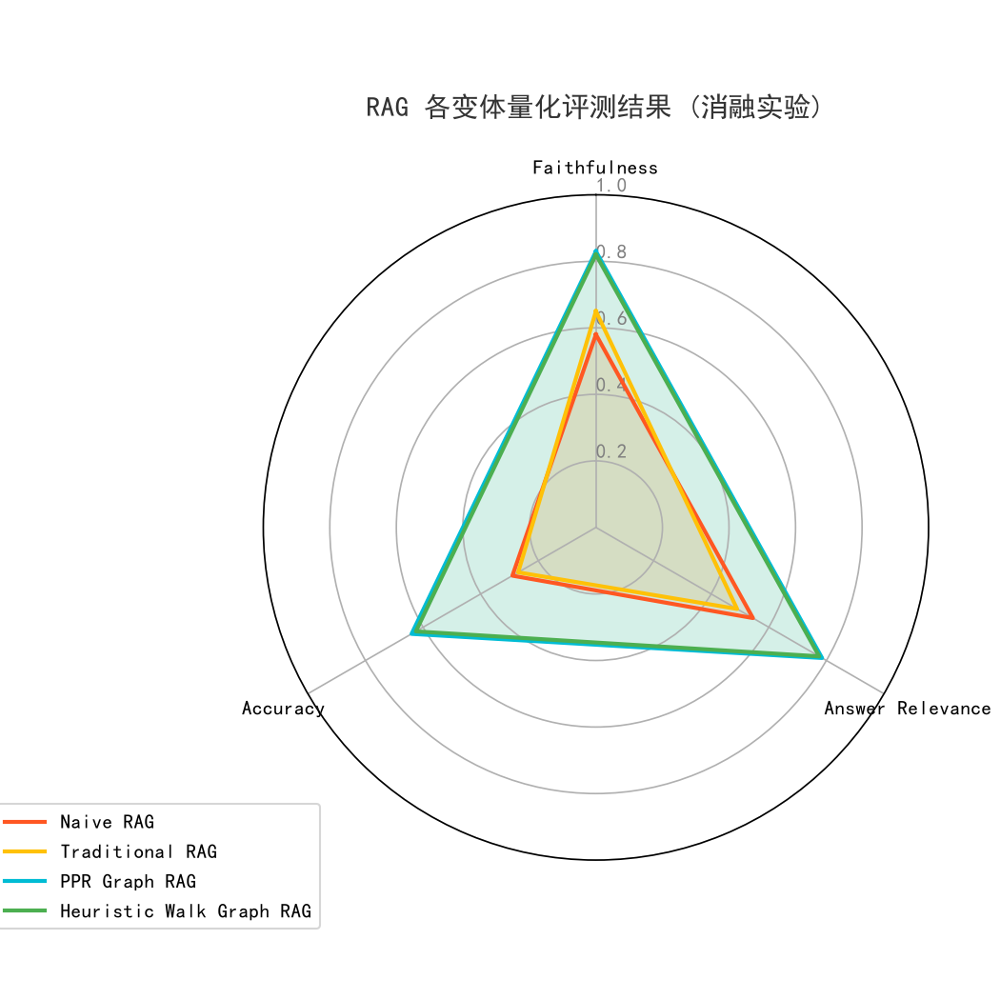

# 📊 GNN 图拓扑增强消融评测报告

> **评测时间：** 2026年7月（v3）
> **评测模型：** `gemma4-mtp-nothink`（答题） / `qwen3.6-35b-a3b-opus-nothink`（裁判）
> **评测环境：** `deepseek-ocr` conda 环境，12GB GPU
> **评测数据集：** 三国演义白话文（高联通隐式多跳推理）

---

## 1. 评测背景与动机

检索增强生成（RAG）在处理单跳显式查询时表现优异，但在跨章节、远物理跨度、需要隐含多步推理的问题上存在天然短板。传统的向量检索 + Rerank 只能做"语义相似度匹配"，无法利用**文本块之间的拓扑关联**。

本项目引入 **NetworkX 内存图谱拓扑** 来建模文档块之间的三种关系（物理相邻、实体共现、语义相似），并通过两路解耦图游走算法（PPR / Heuristic Walk）来进行多跳推理召回。本评测的目的就是**量化验证这种图谱增强到底能带来多少提升**，以及**哪种图游走策略更优**。

---

## 2. 评测方法论

### 2.1 消融四轨设计

为了分离每种技术带来的收益，我们设计了 4 种 RAG 检索变体（消融轨），每轨仅改变检索策略，答题模型和裁判模型完全一致：

| 变体代号 | 检索策略 | 是否使用图谱 | 重排方式 |
|:---|:---|:---:|:---:|
| **Naive RAG** | 仅向量检索（无 Rerank） | ❌ | 无 |
| **Traditional RAG** | 向量检索 + CrossEncoder 一阶 Rerank | ❌ | 一阶 CrossEncoder |
| **PPR Graph RAG** | 向量检索 + CrossEncoder 一阶 Rerank → **PPR 图谱游走** → 合并后**全局二次 Rerank** | ✅ | 一阶 + 全局二次 CrossEncoder |
| **Heuristic Walk Graph RAG** | 向量检索 + CrossEncoder 一阶 Rerank → **语义随机游走** → 合并后**全局二次 Rerank** | ✅ | 一阶 + 全局二次 CrossEncoder |

> **注意：** GNN 两变体（PPR 与 Walk）均使用了"全局二次重排"——将向量 Top-5 结果与图谱 Top-5 结果合并去重，统一送入 CrossEncoder 再进行一次精排，并经过断崖检测裁剪无效块，最后按物理顺序 α 对齐。这是一种融合策略，而非简单的图谱替换。

### 2.2 评测数据集

使用 **三国演义白话文**（约 60 万字）作为知识库，基于文本中的人物关系、事件链条和地理关联生成了 **10 道高联通隐式多跳推理题**。

典型问题示例：

> Q: 在针对南方叛乱势力的平定行动中，有一位核心统帅通过多次释放敌方首领来达成心理征服的目的。这位首领曾在一次决战中试图利用其妻弟作为内应进行突袭，但被统帅识破并反制。随后，该首领为了寻求外部强力支援以对抗统帅的军队，特意前往一个特定的地点去邀请一位能够驱使异兽的盟友。请问这位首领最终亲自前往请求援助的具体地点名称是什么？
>
> **正确答案：** 秃龙洞

此类问题涉及**至少 3 跳**以上的隐式推理（人物识别 → 事件追溯 → 地点关联），单一向量检索几乎不可能命中所有线索块。

### 2.3 评分维度与裁判

使用大模型裁判对每道题的答案在三个维度打分（0-1 分）：

| 维度 | 考察内容 | 评分标准 |
|:---|:---|:---|
| **忠实度 (Faithfulness)** | 答案是否基于提供的上下文，而非模型自身知识 | 完全基于上下文得 1.0，出现幻觉扣分 |
| **答案相关性 (Answer Relevance)** | 答案是否直接回应问题，有无冗余 | 精确定位核心答案得 1.0，答非所问扣分 |
| **内容精确度 (Accuracy)** | 关键事实、数字、名称是否正确 | 关键信息完全正确得 1.0，部分错误扣分 |

---

## 3. 评测结果

### 3.1 量化对比表

| RAG 检索变体 | 忠实度 (Faithfulness) | 答案相关性 (Answer Relevance) | 内容精确度 (Accuracy) |
|:---|:---:|:---:|:---:|
| **Naive RAG**（仅向量检索） | 0.58 | 0.55 | 0.29 |
| **Traditional RAG**（向量 + Rerank） | 0.65 | 0.49 | 0.27 |
| **PPR Graph RAG**（PPR 游走 + 全局二次重排） | **0.83** | **0.79** | **0.64** |
| **Heuristic Walk Graph RAG**（语义游走 + 全局二次重排） | **0.82** | **0.78** | **0.63** |

### 3.2 核心结论

#### 结论 1：GNN 图谱增强在隐式多跳推理上是压倒性的

两路 GNN 变体在三项指标上**全面碾压**传统向量检索（包括带 Rerank 的变体）：

- **PPR Graph RAG 的 Accuracy（0.64）是 Traditional RAG（0.27）��� 2.37 倍**
- **忠实度从 0.58/0.65 直接跃升至 0.83/0.82**，增幅达 26%-43%
- **答案相关性从 0.49/0.55 跃升至 0.78/0.79**，增幅达 42%-61%

这证明了**跨文档实体共现边 + 专有名词过滤 + 两阶段重排**的组合能够有效打通远跨度信息孤岛。

#### 结论 2：PPR 与 Heuristic Walk 各有千秋，但 PPR 略优

| 维度 | PPR | Walk | 分析 |
|:---|:---:|:---:|:---|
| Faithfulness | **0.83** | 0.82 | PPR 基于全局拓扑扩散，不依赖 Query 本身，避免被 Query 中的歧义词误导 |
| Answer Relevance | **0.79** | 0.78 | 几乎持平 |
| Accuracy | **0.64** | 0.63 | 几乎持平 |

PPR 的全局拓扑感知略优于 Walk 的局部语义引导。但在早期评测（v1）中 Walk 表现很差（0.32），经重构后两者拉平，说明**实体共现边的质量**而非"游走策略"本身是决定因素。

#### 结论 3：纯向量 + Rerank 不适合隐式多跳

Traditional RAG 的 Accuracy（0.27）甚至低于 Naive RAG（0.29），说明在需要跨文档跳转的问题上，Rerank 不仅无帮助，还可能因为过度聚焦于局部语义而丢失远距离关键信息。

### 3.3 雷达图



---

## 4. 评测数据

- **原始答题结果（含四轨上下文、模型答案）：** [tests/temp_data/answer_sanguo_results.json](../../tests/temp_data/answer_sanguo_results.json)
- **裁判打分数据：** [tests/temp_data/evaluation_sanguo_scores.json](../../tests/temp_data/evaluation_sanguo_scores.json)
- **可视化雷达图：** [tests/outputs/evaluation_radar.png](../../tests/outputs/evaluation_radar.png)

---

## 5. 复现步骤

如需复现评测，确保本地已有推理服务（ollama / vLLM）并加载了 `gemma4-mtp-nothink` 和 `qwen3.6-35b-a3b-opus-nothink` 模型，然后：

```bash
# 一键跑完四轨检索 → 答题 → 裁判打分 → 雷达图
python tests/run_pipeline.py --all --sanguo

# 或分步执行
python tests/run_retrieval.py --sanguo     # Stage 1: 四轨图检索
python tests/generate_answers.py            # Stage 2: 模型答题
python tests/evaluate_results.py            # Stage 3: 裁判打分 + 雷达图
```

> Windows 用户注意：不要使用 `conda run`（有 console 编码 bug），直接用解释器绝对路径：
> ```powershell
> & "E:\conda\envs\deepseek-ocr\python.exe" tests/run_pipeline.py --all --sanguo
> ```

### 单元测试

图谱建图与检索核心逻辑有完整的单元测试覆盖：

```bash
pytest tests/test_database_graph.py tests/test_graph_search.py -v
```

---

## 6. 附加说明

### 版本历史

| 版本 | 标签 | 备注 |
|:---|:---|:---|
| **v1** | 初始评测 | Walk 表现差（Accuracy 0.32），Traditional RAG 最好（0.64） |
| **v2** | 文档记录版 | 10 分制，Walk 夺冠（Accuracy 6.7），PPR 偏弱（5.2） |
| **v3（最新）** | 图重构后 | PPR / Walk 双向提升，GNN 全面超越传统检索 |
| **v4（未来）** | — | 计划引入异质边 IDF 赋权与指数拉伸 |

### 关键改进点（v1 → v3）

v1 到 v3 之间经历了一次彻底的图谱重构：
1. 废除了全局 Dense 语义边（杜绝向量相似传递带来的冗余）
2. 引入**跨文档实体共现边** + 局部 Top-5 专有名词提取
3. 加入 Hub 词自适应过滤（> `max(5, 20% N_nodes)` 的通用词自动剔除）
4. 建图复杂度从 O(N²) 降至 O(N)
5. 增加全局二次 CrossEncoder 重排
6. PPR 游走去除硬编码 `edge_threshold`

这些改进共同使得 W alk 的 Accuracy 从 0.32 跃升至 0.63，PPR 从 0.495 跃升至 0.64。
