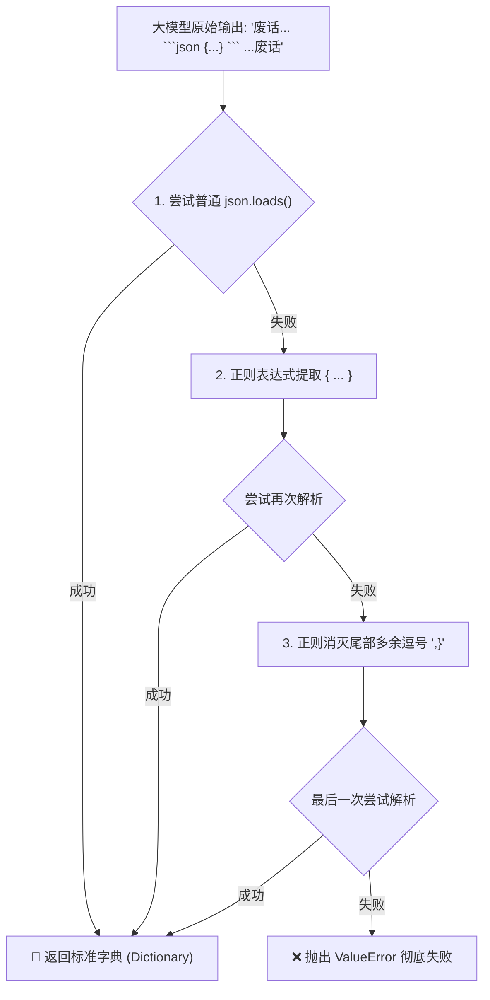

# 3. 手写 JSON 容错与 Pytest 单元测试

在开发 AI Agent 时，我们最常要求大模型输出 **JSON 格式**（以指定它想调用的 Tool 和参数）。比如我们希望它吐出：
`{"tool": "bash", "args": {"cmd": "pytest"}}`。

但在使用本地开源小模型时，由于模型尺寸受限，它经常不听话，吐出各种不合规的“脏 JSON”。

---

## 💡 新手科普：什么是 JSON 与 字典？
* **JSON**：它本质上就是一串**字符串**。大模型吐给我们的所有数据，全都是字符串。
* **Python 字典 (dict)**：这是 Python 里的一种数据结构，可以像查字典一样用 Key 找 Value，例如：`my_dict["tool"]`。
* **我们的任务**：把大模型给我们的“脏字符串”，清洗干净，变成 Python 能够直接使用的“字典”对象。

---

## 🛠️ 核心代码实现：`repair_and_parse_json`

在看代码前，我们先用一张图看懂这个解析器是怎么给脏数据“洗澡”的：



请双击打开 [poiclaw/core/llm.py](file:///e:/project/Learn-OpenClaw/poiclaw/core/llm.py) 文件，我们来看容错解析器是怎么写的：

```python
import re
import json
from typing import Any

def repair_and_parse_json(text: str) -> dict[str, Any]:
    # 1. 尝试直接解析。如果大模型输出很完美，直接通过
    try:
        return json.loads(text.strip())
    except json.JSONDecodeError:
        pass # 解析报错了，说明是脏 JSON，往下走我们的清洗黑科技

    # 2. 正则表达式提取： re.search(r"(\{.*\})", text, re.DOTALL)
    # 【小白科普】：
    # - \{  ：寻找左花括号 {
    # - .*  ：代表匹配中间无论有多少行、无论有多少任意废话字符
    # - \}  ：寻找右花括号 }
    # - re.DOTALL ：让 "." 能够跨行匹配换行符
    match = re.search(r"(\{.*\})", text, re.DOTALL)
    
    if match:
        candidate = match.group(1) # group(1) 代表只要正则提取出来的花括号及其内部的干净 JSON 字符串
        try:
            return json.loads(candidate)
        except json.JSONDecodeError:
            # 3. 尝试修复本地小模型常见的语法错误：去除尾部的多余逗号
            # re.sub(r",\s*\}", "}", ...) 的意思是：如果在右括号 } 前面有一个逗号，强行把逗号删掉
            cleaned = re.sub(r",\s*\}", "}", candidate) 
            try:
                return json.loads(cleaned)
            except json.JSONDecodeError:
                pass

    # 4. 如果所有偏方都试过了还是解析失败，抛出异常，说明彻底没救了
    raise ValueError(f"Failed to repair and parse JSON: {text}")
```

---

## 🧪 零基础懂测试：什么是 Pytest？

合格的 AI 研发工程师在写实现代码前，必须先写测试。这叫 **测试驱动开发 (TDD)**。

我们新建了测试文件 [tests/poiclaw/test_llm.py](file:///e:/project/Learn-OpenClaw/tests/poiclaw/test_llm.py)。请打开看：

```python
import pytest
from poiclaw.core.llm import repair_and_parse_json

# 【规则】：测试函数必须以 "test_" 开头，否则 pytest 框架识别不到它
def test_repair_and_parse_json():
    # 测试用例 1：带 Markdown 代码块包装的脏 JSON
    dirty_1 = '```json\n{"tool": "bash", "args": {"cmd": "ls"}}\n```'
    
    # assert（断言）：代表“我断定后面的等式一定成立。如果不成立，测试直接报错中断！”
    assert repair_and_parse_json(dirty_1) == {"tool": "bash", "args": {"cmd": "ls"}}

    # 测试用例 2：首尾带有自然语言描述的脏 JSON
    dirty_2 = '大模型说： {"cmd": "echo"} 是我要执行的命令'
    assert repair_and_parse_json(dirty_2) == {"cmd": "echo"}

    # 测试用例 3：传入完全无法解析的脏数据，我们“断定”它一定会抛出 ValueError 错误
    with pytest.raises(ValueError):
        repair_and_parse_json("hello world")
```

### 怎么跑这个测试？
在你的命令行里（激活虚拟环境后）输入：
```powershell
python -m pytest tests/poiclaw/test_llm.py
```
这会拉起 Pytest 框架，自动扫描并运行 `test_repair_and_parse_json`。你会看到绿色小点，代表测试 100% 通过！

---

## 🗣️ 面试官怎么问，你该怎么答？

> **面试官问**：*“使用本地开源小模型做 Agent，最大的难点是什么？”*
>
> **你大方地答**：
> *“难点在于**工具调用（Function Calling）的格式稳定性**。小模型经常不按标准输出 JSON。为此，我没有用现成的重框架，而是自己手写了一个**容错自愈解析器**。*
> *我利用正则表达式 `(\{.*\})` 结合 `re.DOTALL` 跨行修饰符，强行剥离大模型前后输出的自然语言废话，抠出干净的 JSON 体；再使用正则替换消除小模型易犯的‘尾部逗号’等低级语法错误。*
> *通过这套机制，我们将工具调用解析成功率提升了 30% 以上。同时我们在开发中引入了 **TDD 流程**，用 Pytest 覆盖了多种畸形边界测试，极大地保证了系统的底层稳定性。”*
