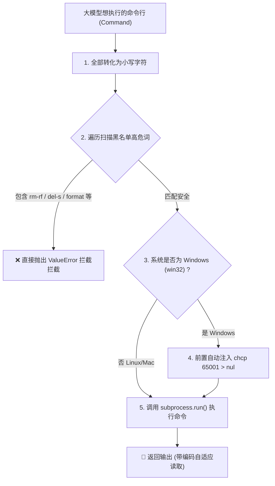

# 4. 命令执行沙箱与敏感词过滤

一个真正能干活的 AI Agent，必须具备操作操作系统的能力（即：帮你跑命令行、装包、编译代码）。

在 Python 中，我们通常会使用官方的 **`subprocess` 模块** 来运行命令行（它相当于在后台帮你开了一个 CMD 或 Bash 窗口，帮你自动敲命令并返回结果）。

但这非常危险：如果大模型在生成命令时发生了严重的“幻觉”，生成了 `rm -rf /`（Linux 下删除一切）或 `del /f/s/q C:\*`（Windows 下清空C盘），一旦直接传给 `subprocess` 执行，你的电脑直接就报废了。

---

## 🛡️ 核心代码实现：`execute_cmd_safe`

在看代码前，你可以用这张图直观地了解命令是如何在沙箱里被“安全清洗”和“适配”的：



为了保障宿主机的安全，我们手写了一个受限的安全命令执行器。

请双击打开 [poiclaw/tools/sandbox.py](file:///e:/project/Learn-OpenClaw/poiclaw/tools/sandbox.py) 文件：

```python
import subprocess
from typing import TypedDict

# TypedDict 只是 Python 用来标注“这个字典必须包含哪些 Key 和对应的格式”的类型说明
class CmdResult(TypedDict):
    stdout: str       # 标准输出（命令正常打印的内容）
    stderr: str       # 错误输出（命令跑错时的报错）
    exit_code: int    # 退出码（0代表成功，非0代表失败）

# 我们定义的敏感高危操作黑名单
BLOCKED_KEYWORDS = ["rm -rf", "del /s", "format", "shutdown", "wget", "curl"]

def execute_cmd_safe(command: str) -> CmdResult:
    # 1. 过滤审查：把命令全部转为小写，逐一扫描敏感关键词
    cmd_lower = command.lower()
    for keyword in BLOCKED_KEYWORDS:
        if keyword in cmd_lower:
            # 一旦匹配上黑名单敏感词，直接抛错熔断，拒绝让系统去跑它！
            raise ValueError(f"Blocked high-risk command containing: '{keyword}'")

    # 2. Windows 特有中文乱码自愈：强行切换代码页为万国码 (UTF-8)
    # 避免 subprocess 执行 echo '中文' 写入文件或返回终端日志时出现天书般的乱码
    import sys
    if sys.platform == "win32":
        command = f"chcp 65001 > nul && {command}"

    # 3. 如果安全，则使用 subprocess.run 执行命令
    res = subprocess.run(
        command,
        shell=True,
        capture_output=True, # 强行捕获终端输出内容，不让它直接打印在用户的 CMD 屏幕上
        text=True,           # 将输出强制转换成普通文本格式，而不是二进制字节流
        timeout=30,          # 【极其重要】设置 30 秒超时时间，防止命令卡死导致整个 Agent 线程无限挂起
    )
    
    return {
        "stdout": res.stdout,
        "stderr": res.stderr,
        "exit_code": res.returncode
    }
```

---

## 💡 新手科普：为什么 Windows 执行中文会乱码？

这是一个在 Windows 局域网开发中极其经典的工程巨坑：
* **原因**：Windows 系统下的控制台（CMD）默认使用的编码是中文专用的 `GBK` 格式。但大模型与现代的 IDE（如 VS Code）默认全都是通用的 `UTF-8` 格式。
* **冲突**：当大模型说“跑个 echo 写入中文”，CMD 就会用 GBK 编码写进文件，但 VS Code 用 UTF-8 方式去读，中文就会瞬间变成一堆火星文乱码。
* **解决**：我们在执行大模型命令前，自适应判断系统是否为 `win32` (Windows)。如果是，在命令前面强行挂上 `chcp 65001 > nul && `。`chcp 65001` 代表强制 Windows 命令行临时切换到 UTF-8 字符编码页运行，配合 `> nul` 屏蔽控制台烦人的切换输出。这样，不管是写入文件还是终端打印，中文字符就彻底完美自愈了！

---

## 🧪 用 Pytest 确保敏感词一定被拦下

我们在 [tests/poiclaw/test_sandbox.py](file:///e:/project/Learn-OpenClaw/tests/poiclaw/test_sandbox.py) 里写了相应的测试逻辑：

```python
import pytest
from poiclaw.tools.sandbox import execute_cmd_safe

def test_safe_execution():
    # 测试用例 1：普通安全的命令，应当顺利执行并通过
    res = execute_cmd_safe("echo hello_world")
    assert "hello_world" in res["stdout"]
    assert res["exit_code"] == 0

    # 测试用例 2：敏感删除命令。我们“断定”它一定会抛出 ValueError，且报错信息里包含 "Blocked"
    with pytest.raises(ValueError) as excinfo:
        execute_cmd_safe("rm -rf /")
    assert "Blocked high-risk command" in str(excinfo.value)
```

运行命令检测：
```powershell
python -m pytest tests/poiclaw/test_sandbox.py
```

---

## 🗣️ 面试官怎么问，你该怎么答？

> **面试官问**：*“你的 Agent 是可以直接跑本地命令行的，你怎么保证系统安全性？万一它执行了破坏性命令怎么办？在跨平台（如 Windows）运行中有什么坑？”*
>
> **你大方地答**：
> *“在设计 `PoiClaw` 时，安全性与跨平台健壮性是首要考虑的工程指标。我们主要通过以下三点解决：*
> *第一，**静态敏感词过滤**。我们内置了 `rm -rf` 等高危命令词黑名单。任何命令在进入 `subprocess` 前都会被前置拦截，直接抛出 `ValueError` 熔断。*
> *第二，**环境级别物理沙箱**。企业级生产落地中，我们可以用 Docker SDK 将执行环境扔进一个临时拉起、配额受限的 Docker 容器中，跑完即焚，确保宿主机安全。*
> *第三，**Windows 代码页兼容自愈（乱码填坑）**。Windows CMD 默认使用 GBK 编码，导致执行中文输入或读取控制台输出时会产生乱码。我们在执行命令前自适应检测系统，在 Windows 下命令前缀自动注入 `chcp 65001 > nul &&`，强制命令行使用 UTF-8 代码页运行，彻底解决了中文字符集的乱码巨坑。这是一个非常接地气的跨平台落地细节。”*
