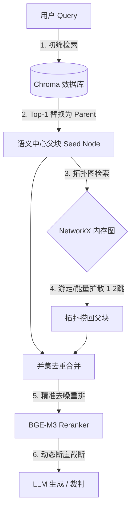

# 拓扑增强父子块 RAG 系统设计规格说明书 (Spec)

本规格说明书旨在为现有的 **BGE-M3 父子块 RAG 项目** 设计并引入一套免训练的拓扑图增强检索机制，以攻克跨章节隐式多跳推理难题，并实现全自动的“防作弊”评测体系。

---

## 一、 系统整体定位与 Dify 集成架构

本项目定位为 **外挂式拓扑增强检索流水线 (Post-Retrieval Pipeline)**，与底层向量数据库及检索底座保持完全解耦（零侵入、零修改）。

### 1. 架构流向图

### 2. Dify 独立节点集成
在 Dify 编排平台中，本项目将作为一个独立的 **“后置处理节点 (Post-Retrieval Node)”**（或通过 API 节点调用本系统的 `/retrieve` 增强端点）：
*   **输入**：初始向量检索节点召回的 Top-1 父块 ID、用户 Query。
*   **输出**：经拓扑增强、二次重排及断崖去噪后的最终高质量上下文。

---

## 二、 离线数据预处理：全量伪装脱敏管道 (Anti-Cheating)

为了防止基座大模型依赖预训练常识在测试中“闭卷作弊”，需要对评测用的名著（如《三国演义白话文》）进行全自动的实体指代消解与换皮脱敏，且不能污染用户原有的书籍文件。

### 1. 处理流程 (disguise_book_generator.py)
*   **原始书籍路径**：`E:/project/pyltp-books-master/pyltp-books-master/mybooks/Book/` (只读，禁止修改)。
*   **生成测试集输出路径**：`e:/project/advanced-rag/tests/temp_data/` (隔离的临时数据目录)。

### 2. 伪装脱敏三步走算法：
1.  **实体提取 (NER)**：利用 `jieba.posseg` 对全书进行名词扫描，筛选出出现频次大于 10 次的专有名词（词性包含 `nr`, `nz` 等）。
2.  **别称聚类对齐 (Alias Clustering)**：将筛选出的人名分批发送给大模型（只在离线处理阶段调用一次），由大模型进行指代消解合并（例如把“刘备、玄德、刘皇叔、使君”对齐为同一个人），并生成唯一的代号（如 `角色_Alpha`）。保存为 `sanguo_aliases.json`。
3.  **逆向长度最大替换 (Safety Replace)**：加载 JSON，按照别称字符长度降序排序（防止短别称截断长别称导致替换错误），全局替换生成 60 万字的完全伪装小说 `三国演义白话文_disguised.txt`。

---

## 三、 离线建图方案：底座 NetworkX 内存图

系统启动或增量入库时，直接基于 Chroma 的元数据，利用 `NetworkX` 在内存中构建一个图拓扑网络。

### 1. 节点设计 (Nodes)
*   **Node ID**：Chroma 数据库中的 `parent_id` (MD5 字符串)。
*   **Node Attributes**：
    *   `parent_text`: 存储父块的完整原始文本。
    *   `dense_embedding`: 缓存该父块的 Dense 向量（1024 维 float 数组，供内存相似度点积计算，不保存到物理文件）。
    *   `source_path`: 所属文件路径（用来区分大海背景与伪装测试集）。
    *   `filename`: 源文件名。

### 2. 三轨连边算法 (Edges)
1.  **物理邻近边**：在同一个文档（相同 `source_path`）中，将按 `char_start` 排序相邻的前后父块节点建立连接。
2.  **无监督 TF-IDF 实体共现边**：
    *   在分词前，用正则表达式（如 `r"(角色|代号|项目|特工)\s*[A-Za-z0-9_]+"`）动态捕获所有的脱敏代号，调用 `jieba.add_word()` 防止分词切碎。
    *   使用 `jieba.posseg` 对父块分词并过滤停用词，利用局域 TF-IDF 提取前 5 个特征词。若同一个文档中的两个父块共享至少一个特征词，则建立实体共现边。
3.  **局域与 ANN 语义关联边**：
    *   **局域余弦相似度**：在同一个 `source_path` 内部的父块之间，直接利用 NumPy 进行向量两两点积。相似度 $\ge 0.82$ 则连边。
    *   **跨文档 ANN 检索连边**：跨文档时，以每一个父块的 Dense 向量在 Chroma 中进行检索，与检索出的 Top-5 最相似节点中相似度 $\ge 0.85$ 的节点建立连接。该优化将复杂度从 $\mathcal{O}(N^2)$ 降低到 $\mathcal{O}(N \log N)$。

---

## 四、 在线检索与双路融合 (Post-Retrieval Core)

### 1. 语义中心定位
1.  用户输入 Query，计算 Dense 与 Sparse 向量。
2.  调用 `ChromaAdapter.hybrid_search` 初筛召回 Top-15 的父块。
3.  通过 `RerankerService` 一轮重排，选择得分最高（Top-1）的父块节点锁定为 **Seed Node**（能量起点）。

### 2. 拓扑检索算法实现（支持配置切换）
*   **策略 A：个性化 PageRank (PPR)**
    *   以 Seed Node 设为唯一能量源（权重 1.0），其余为 0。
    *   设置传送概率为 0.15。
    *   调用 `nx.pagerank` 计算全图各节点分值，保留除起点外得分最高的 Top-5 父块。
*   **策略 B：BGE-M3 语义引导 2 跳随机游走（默认开启）**
    *   **第 1 跳**：计算 Seed Node 所有直接邻居与 Query 的语义相似度，做 Softmax 归一化，保留得分最高的前 3 个节点。
    *   **第 2 跳**：分别计算这 3 个节点的所有直接邻居（排除起点）与 Query 的相似度，保留前 2 个节点。
    *   熔断：在 2 跳时强制终止游走，去重合并所有捞出的节点作为拓扑补充。

### 3. 合流重排与断崖阻断
*   **去重合并**：初筛候选集与拓扑捞回父块集求并集。
*   **二次 Rerank**：使用 Cross-Encoder 对合并集进行深度重排。
*   **语义断崖截断**：按得分降序排序，一旦相邻分数落差超过断崖阈值（默认 1.5），即时阻断切除后续所有低相关文本，最大力度降噪。

---

## 五、 防作弊评测体系 (Evaluation Pipeline)

1.  **“大海捞针”混淆部署**：
    *   “大海”（60万字原版小说 + 其他论文）不做脱敏直接入库，作为海量干扰背景。
    *   “针”（6000字换皮小说）混入上述大海中导入向量库。
2.  **逆向出题**：
    *   从内存图的 2 跳路径（例如 `角色_Alpha` ── `关系` ── `角色_Beta`）对应的一组父块文本中，利用大模型逆向生成隐藏直接实体关键词的 Level 4 隐式多跳问题。
3.  **独立审计**：
    *   在评测中强制屏蔽 `Answer Correctness`，锁死 **`Context Recall`（上下文召回率）** 进行独立评估。

---

## 六、 开发阶段路线图

1.  **阶段 1**：编写 `disguise_book_generator.py` 预处理脚本，实现 NER 实体提取、LLM 别称对齐和整本文本的安全逆向最大替换。
2.  **阶段 2**：在 `database.py` 中引入内存图管理类 `GraphManager`，使用 `NetworkX` 实现三轨连边与内存图的动态更新。
3.  **阶段 3**：在 `coordinator.py` 和新增的图检索模块中，编写 PPR 算法与 BGE-M3 语义引导游走算法，并与 Reranker 融合层及断崖阻断机制打通。
4.  **阶段 4**：重构 `tests/` 下的评测管线，实现“针混入大海”的数据加载，利用大模型逆向出题并运行 RAGAS 双轨检索打分消融实验。
