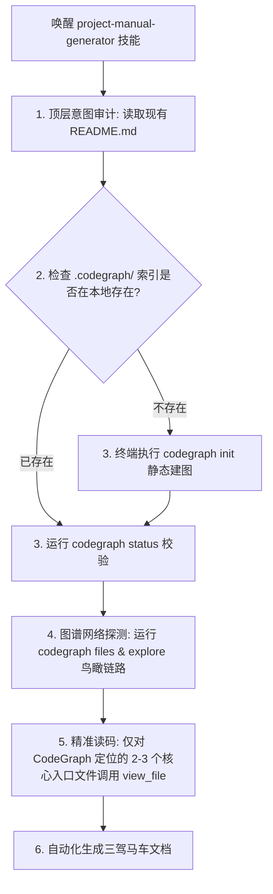

# 2026-07-02 CodeGraph 驱动的“三驾马车”说明书生成器设计Spec

## 1. 痛点与背景 (Background)
*   **知识的诅咒**：项目作者写的 `README.md` 往往充满默认的技术假设，没有背景知识的用户或遗忘代码的作者极难快速跑通日常操作。
*   **Token 爆炸**：传统的文档生成 Agent 在从零熟悉陌生项目时，需要通读海量源文件，不仅耗费巨额 Token 成本，还会因超长上下文引起模型注意力漂移。

## 2. 解决方案：三驾马车 + CodeGraph 静态分析
本设计方案基于本地 CodeGraph 静态符号解算，构建具有高度普适性的三合一文档生成器：
1.  **对公众**：生成符合最佳美学的 `README.md`（高颜值大厂名片）。
2.  **对人类**：生成保姆级白话上手手册 `ONBOARDING_MANUAL.md`（四大避坑、命令翻译、一键复制测试用例及 Gotchas 阻断），并自动在 `.gitignore` 保护。
3.  **对AI Agent**：生成机器可读的 `AGENTS.md` 规约。

---

## 3. 核心架构与数据流 (Data Flow)

---

## 4. 交付物详细规范

### A. ONBOARDING_MANUAL.md (人类白话小册子)
必须强制包含以下四大避坑板块：
*   **Prerequisites \& Setup**：标注 Windows/Docker 环境下的安装“卡点”与虚拟环境拉起步骤。
*   **Quickstart Command Table**：不只列命令行，还要详尽翻译“该命令会启动哪个本地端口，终端黑窗口成功启动后会打印什么”。
*   **Minimal Usage Demo**：提供一段零侵入、复制即可运行的 HTTP 测试或 CLI 脚本。
*   **Gotchas Block**：列出跨容器通信域名映射或 API KEY 缺失等隐藏前置步骤。

### B. AGENTS.md (Agent 运行规约)
*   记录该项目在本地执行测试、打包、代码检查的具体命令、代码结构与编译指令，以便下一任 AI Agent 进场时零摩擦直接接管开发。

### C. README.md (公众开源名片)
*   套用顶级美学规范，配置 Shields.io 徽章对齐导航栏，使用“痛点转化特性矩阵表格”来包装技术亮点，并提供 Mermaid 架构流程图。
