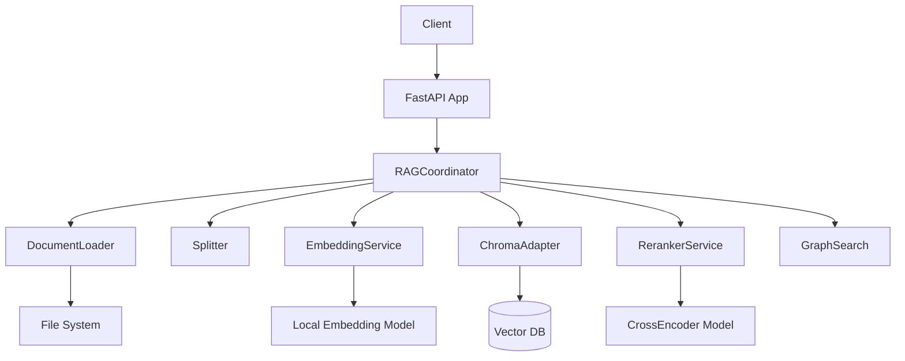
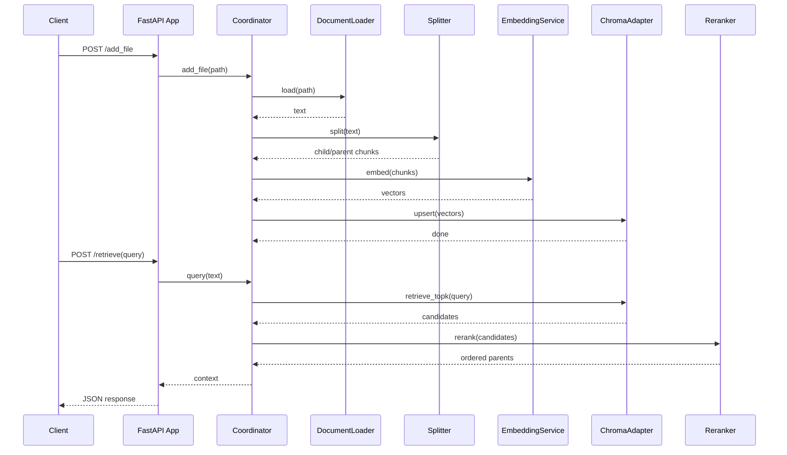

# Architecture

**Type:** pipeline

这是一个基于 FastAPI 的 RAG（检索增强生成）微服务，采用流水线架构将文档导入、向量化存储与混合检索重排串联。系统通过协调器（Coordinator）统一管理加载器、分词器、嵌入服务、向量数据库和重排器，对外暴露 REST API 供客户端查询或导入文件。

## Component Diagram

## Components

### FastAPI App

REST API 入口，提供检索与文件导入接口

Files: `src/app.py`

### Coordinator

编排所有 RAG 组件，统一查询与入库逻辑

Files: `src/coordinator.py`

### DocumentLoader

加载本地文档文件（PDF/Word/Markdown 等）

Files: `src/loader.py`

### SemanticParentChildSplitter

语义感知的父子块切分，150词子块检索、800词父块返回

Files: `src/splitter.py`

### LocalEmbeddingService

本地 GPU/CPU 向量化服务，支持批量与去重

Files: `src/embedding.py`

### ChromaAdapter

Chroma 向量数据库的 CRUD 适配层

Files: `src/database.py`

### RerankerService

CrossEncoder 重排与自适应语义断崖截断

Files: `src/reranker.py`

### GraphSearch

图增强检索（PPR/随机游走），支持拓扑感知召回

Files: `src/graph_search.py`

### ImportObsidian

Obsidian 笔记库批量导入工具

Files: `src/import_obsidian.py`

### Tests

单元测试、评测集生成与检索流水线测试

Files: `tests/test_*.py`, `tests/run_pipeline.py`

## Sequence Diagram

## Data Flow

文档通过 /add_file 接口经 Loader 加载、Splitter 切分为父子块，再由 EmbeddingService 向量化后写入 ChromaDB；查询时客户端调用 /retrieve 接口，系统从向量库召回 Top-K 子块，经 Reranker 重排与语义断崖截断后返回父块拼接的上下文。
