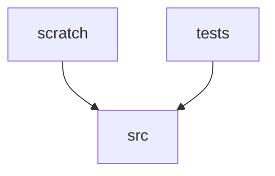

# Module Dependencies

## Core Files (by PageRank)

1. `src\loader.py`
2. `src\embedding.py`
3. `src\splitter.py`
4. `src\database.py`
5. `tests\disguise_book_generator.py`
6. `src\reranker.py`
7. `src\coordinator.py`
8. `src\graph_search.py`
9. `src\app.py`
10. `tests\evaluation_set_generator_graph.py`

## Likely Entry Points

- `README.md`
- `docs\.vitepress\cache\deps\package.json`
- `package.json`
- `src\app.py`
- `.agents\AGENTS.md`
- `.agents\plans\markitdown-integration.md`
- `.claude\handoffs\2026-07-02-201301-gnn-rag-refactor.md`
- `.claude\handoffs\2026-07-02-201606-gnn-pr-refactoring.md`
- `.claude\handoffs\2026-07-10-212901-integrate-markitdown.md`
- `.claude\handoffs\2026-07-10-215815-markitdown-integration.md`
